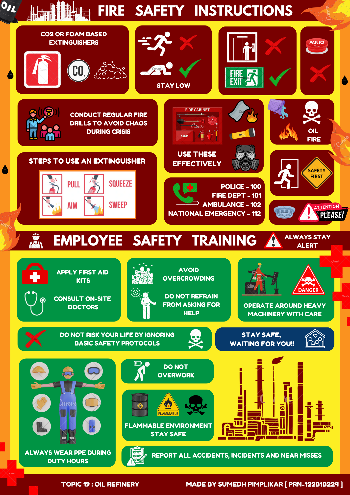
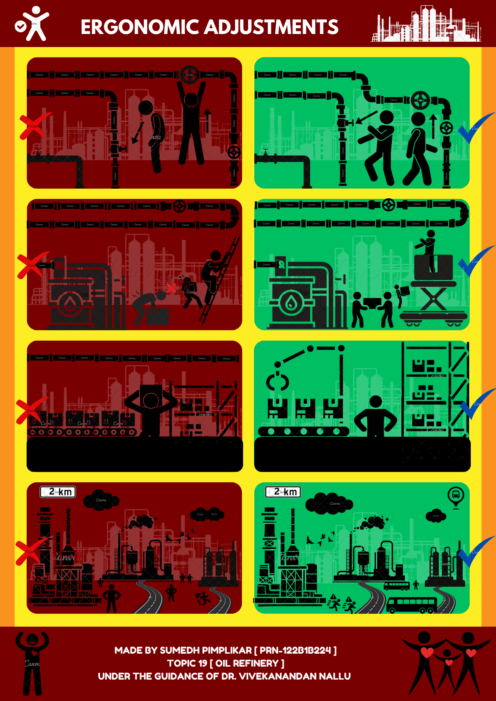

<!-- TITLE with Animated Typing Effect -->

  

  

 

---

 

## 🛡️ Oil Refinery Safety Posters – SHE Project

 

This repository contains poster designs I created as part of my **Safety, Health, and Environment (SHE)** coursework, focusing on:

- **🔥 Fire Safety Instructions & Employee Training**
- **🛠️ Ergonomic Adjustments in Oil Refineries**

These were designed using **Canva** and submitted under the topic **"Oil Refinery Safety"**. I was awarded **full marks** for this submission.

 

---

 

### 📄 Project Highlights:
- **Tool Used:** Canva  
- **Topic:** Oil Refinery – Fire Safety & Ergonomics  
- **Score:** ✅ Full Marks  
- **Course:** Safety, Health and Environment (SHE)  
- **Guided by:** Dr. Vivekanandan Nallu  
- **Made by:** Sumedh Pimplikar `[PRN-122B1B224]`

 

---

 

  

 

  

---

🎓 *Proud moment in my academic journey – Designed for safety, recognized for impact.*

